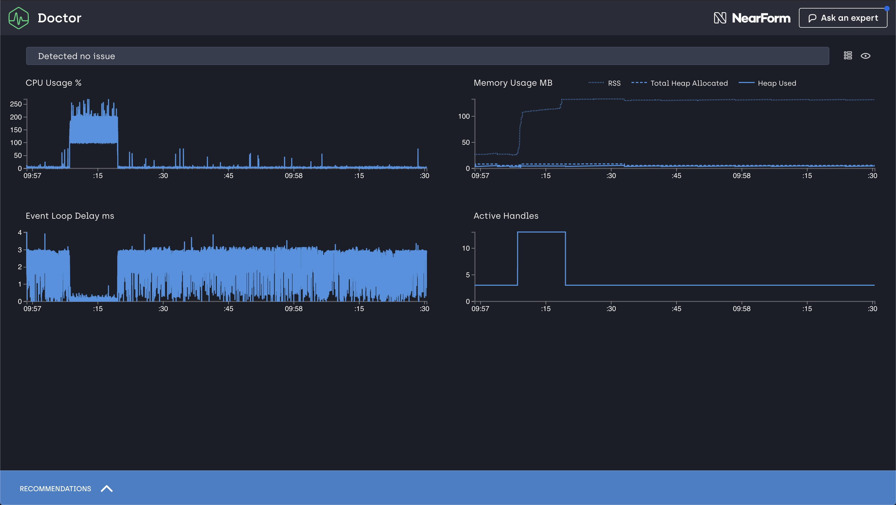

# The Clinic Workshop

## Requirements

* Node 12
* Docker
* Windows/Mac OS/Linux

## Introducing clinic

* `clinic` is a suite of open source tools aimed at helping you find bottlenecks
and performance issues in your applications.
* The tools are meant to be easy to use and "zero conf".
* Read about more clinic on the website, https://clinicjs.org

## Installing clinic

* Before we do anything you need to install clinic from npm
* `npm install -g clinic`
* To check that it works try listing the help `clinic --help`

## The workshop

* You should now have clinic installed \o/
* The workshop will try and guide you through the "clinic flow"
* At the end you should know more about finding bottlenecks and fixing them.

## Benchmarking tools

* To get reliable results you need to use an HTTP benchmarking tool
* An HTTP benchmarking tool will send a ton of requests to a server and analyse the throughput

Our go-to benchmarking tool for the rest of this workshop will be `autocannon`

```sh
npm install -g autocannon
```

Try running `autocannon` against our hello world server do

```sh
autocannon localhost:3000
```

You should get a result similar to this

```
Stat    2.5% 50%  97.5% 99%  Avg     Stdev  Max
Latency 0 ms 0 ms 0 ms  0 ms 0.01 ms 0.1 ms 16.42 ms

Stat      1%      2.5%    50%    97.5%   Avg      Stdev   Min
Req/Sec   33759   33759   37695  38463   37031.28 1466.94 33747
Bytes/Sec 3.85 MB 3.85 MB 4.3 MB 4.39 MB 4.22 MB  167 kB  3.85 MB

Req/Bytes counts sampled once per second.

407k requests in 11.04s, 46.4 MB read
```

* `autocannon` is telling us our server looks really fast
* This is expected as the server is not doing much

## Using clinic doctor

* Open two terminals and run the following commands

```sh
clinic doctor -- node code/hello-world/index.js # first terminal
```

```sh
autocannon localhost:3000 # second terminal
```

After autocannon has finished, return to the first tab and stop clinic via `Ctrl + C`. You should get a result looking similar to this



Opening the `Recommendations` you will see:
`Doctor has found no issue` - As expected our hello world server has no detectable issues.

---

## Using clinic doctor

* Instead of running two different terminals you can use the clinic `--on-port <cmd>` flag.
* The `--on-port` script is executed when the benchmark scripts spawns a server that listens on a port.
* You can access the port in the script as `$PORT`.
* Try re-running the benchmark, but use the `--on-port` flag to run `autocannon`.

```sh
clinic doctor --on-port 'autocannon http://localhost:$PORT' 
  -- node code/hello-world/index.js
```
Alternatively you can run it like so

```sh
clinic doctor clinic doctor --autocannon [ / ] 
  -- node code/hello-world/index.js
```
You can refer to the readme https://github.com/nearform/node-clinic for an example

## Always start with the doctor

* Awesome, you should have gotten the hang of running `clinic doctor` now.
* When trying to diagnose performance issues, running `clinic doctor` is always a good first step.
* Note that this isn't magic and sometimes doctor gets things wrong
* Let's move on to more complex servers

---
# Next Exercise - npm-query-server

## Prep: Setting up a database

* For the upcoming exercises you need to use a MongoDB database running locally
* If you have docker installed you can get the full database with data using

```sh
docker pull mafintosh/npm-in-mongo
docker run -it -p 27017:27017 -d mafintosh/npm-in-mongo
```

## Prep: Getting some data 

* NOTE: Skip this step if the docker container worked
* To fill up an empty database, we've made a little helper script, https://github.com/nearform/import-npm-to-mongodb
* Use this to import npm metadata

```sh
npx import-npm-to-mongodb -s 20
```

## The next server

* You should now have the MongoDB running with some of the imported npm metadata.
* Let's look at a new server

```js
const mongojs = require('mongojs')
const fastify = require('fastify')
const computeMagic = require('@nearform/compute-magic')

const db = mongojs('localhost:27017/npm')
const c = db.collection('modules')
const app = fastify()

// get 5 newest and 5 oldest, no index
app.get('/', function (req, reply) {
  c.find().sort({modified: -1}).limit(5, function (err, newest) {
    if (err) return reply.code(500).send(err)
    c.find().sort({modified: 1}).limit(5, function (err, oldest) {
      if (err) return reply.code(500).send(err)
      const magic = computeMagic(newest, oldest)
      reply.send({
        magic,
        newest,
        oldest
      })
    })
  })
})

app.listen(3000)
```

The server returns the latest 5 and oldest 5 npm modules from the database.

```sh
cd npm-query-server
```

Install the dependencies: 

```sh
npm i
```

Try running it to see if it works

```sh
node index.js
```
Visit `localhost:3000`

## Benchmarking it

* Try running `autocannon` against it to see how many requests per second it can deliver.
* As you have probably noticed from the `autocannon` stats this server is quite slow.
* Let's try to investigate why.
* Try running `clinic doctor` against the server and see what it reports.

## Investigating the issue

* Doctor should report that there is an I/O issue with the application.
* To debug these you can use the `bubbleprof` tool.
* Try running `bubbleprof` against the server, by simply replacing `doctor` with `bubbleprof` on your command line.

## Bubbleprof

* When bubbleprof finished it should open the bubbleprof UI.
* If this is your first time using bubbleprof you might want to take a look at the walkthrough linked from the UI.
* Basically each bubble represents I/O time.
* The bigger the bubble the more time is spent there
* Bubbleprof should show that there is a ton of MongoDB activity happening
* Try diving into the MongoJS bubbles and find the stacks for them in the UI.

# Investigating Mongo

* Bubbleprof is telling us a lot of time is being spent in MongoDB.
* Let's investigate how that time is spent.
* Try opening a MongoDB client shell, if you are running the docker container you'll need to get the container id first

```sh
docker ps | grep mongo # COPY CONTAINER ID
docker exec -it <CONTAINER ID> /bin/bash
```

* `mongo` should connect you to the db
* Run `use npm` to connect to the `npm` db.
* Try running the query:

 ```sh
 db.modules.find().sort({modified: -1}).limit(5)
 ```

* Notice how the query is a bit slow on subsequent tries?
* Try adding `.explain()` to the end of your query to have MongoDB tell you how it searches.

## Investigating Mongo Continued

* As you might have noticed from the `.explain()` output the Mongo query is doing a full collection scan to resolve our query.
* Try using `db.getCollectionNames()` to see if there is any other collections that can help us.
* Try doing the query from the `modulesIndexed` collection instead
* Use `.explain()` to understand why it is faster.
* Using an indexed collection will probably improve our performance.
* Try updating the server code to use the `modulesIndexed` collection instead.
* When done try running `autocannon` against it again.

## Moving on to the next issue

* Faster, but still not as fast as you'd expect.
* Try using autocannon's `-c 100` flag to use 100 parallel connections to see if that speeds it up.
* Try running `doctor` again to see if it can pick up any new issues

## Event loop issues

* Doctor should find an event loop issue.
* You can read more about those in the doctor UI.
* Basically the CPU is blocking the event loop.

## Flame

* To investigate CPU issues you can use `clinic flame`.
* Run the same command as before, replacing `doctor` with  `flame`.

## Flamegraphs

* `clinic flame` produces a flamegraph.
* A flamegraph is a visualisation of which are being called the most.
* When looking for issues you look for wide red sections in a flamegraph.

## Investigating the issue

* You probably notice that `computeMagic` is used a lot.
* This method doesn't really seem to do much, so it is probably safe to remove it.
* Try removing `computeMagic` and see if that makes the server faster.
* Use `autocannon` to see how many requests per second it can serve now.

## Much faster!

* The server is now much faster!
* Try using `clinic doctor` to see if it can find any other issues.
* Doctor shouldn't find any issues.
* Our server is now pretty performant!

## Next steps

* Okay, `doctor` could not find any new issues with our server. That is great!
* This doesn't mean there isn't anything you can do to improve it though.
* Try running bubbleprof on the server again and let's see if there is anything you can try to improve


## Refactoring

* Try refactoring the server to run the queries in parallel and see the difference in performance in in bubbleprof.
* Try using async/await and rerunning bubbleprof
